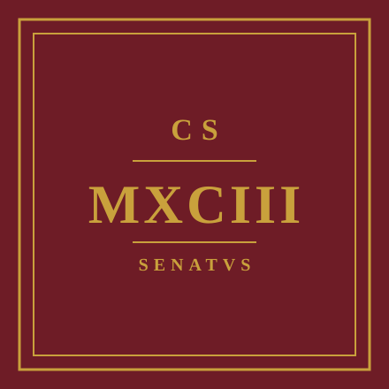

  

<h1 align=center>CS・MCXIII・SENATVS</h1>
<h4 align=center><em>COMITAS OMNIBVS OPORTET</em></h4>

---

Welcome to the organization behind **CS-UY 1113: Programming and Problem Solving I** at the **NYU Tandon School of Engineering**. This org hosts the course material, tooling, and resources maintained by the instructional team—professors, course assistants, and lab staff—each semester the course runs.

## Repositories

- [**Course-Material**](https://github.com/CS-1113-SENATUS/Course-Material): homework assignments, lab exercises, quizzes, review sessions, and the course-wide problem bank. Start here if you're looking for assignments, solutions, or practice problems.

## About the course

CS 1113 is an introductory course in Python programming and problem solving, covering topics from `print`/`input` basics through functions, lists, tuples, and list
comprehensions. Labs, homework, and quizzes build cumulatively—later material only assumes structures already introduced in class.

## Course resources

- **Syllabus**: available in [Course-Material](https://github.com/CS-1113-SENATUS/Course-Material)
- **Course Community**: course discussion, Q&A, and announcements now run through our own Course Community platform (link posted in Brightspace); it replaces EdStem.
- **Slack**: [Join the CS 1113 workspace](https://join.slack.com/t/cs1113/shared_invite/zt-3c77oznif-gG3M2ZSDiLZmUUQbq8vxkw)

## Senate Meeting Recordings and Materiel

Recordings, materiel, and minutes for CA training sessions and weekly senate meetings. Full minutes archive: [`admin/meeting-minutes/notes`](https://github.com/sebastianromerocruz/CS1113-Team/tree/main/admin/meeting-minutes/notes).

| Session | Video | Material | Minutes |
|:---------:|:-------:|:--------:|:---------:|
| **Training 1**: Intros, Operations, Policy & Safety (08/23/26) | [**Recording**](https://nyu.zoom.us/rec/share/Re1CoeTf0FU8tq9eMIJ8SuXogKmoP1qgM1mieB-AIE_UmxkOd05zKdvI_746ugKM.AOFoi_rpERvg_Z96) | [**Slides**](https://docs.google.com/presentation/d/1XKdmdpcu5uzfpSatHyFtgsS-LEeWQ82vpItO-dVACas/edit?usp=sharing) | [**Minutes**](https://github.com/CS-1113-SENATUS/.github/blob/main/profile/assets/meeting-minutes/notes/2026-08-23-training-1.md) |

## Instructional team

- **Prof. Sebastián Romero Cruz**
- **Prof. Novick**
- **Prof. O'Rourke**
- Course Assistants (CAs): schedules and internal ops are managed privately; reach out via Course Community or Slack if you're a current student.

---

NYU Tandon School of Engineering | CS-UY 1113

